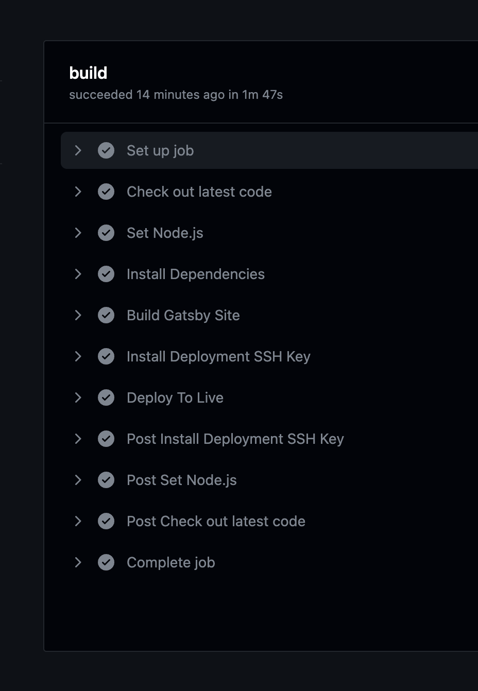

## I'm Still Alive!!

Believe it or not I am still actually maintaining this site for shits and giggles! The latest changes have been centered around addressing a couple major issues that have been gnawing at my conscience:

1. Upgrading Gatsby to the latest (so many security advisories in github!)
2. Automating website deploys

### Gatsby Upgrade

Upgrading major versions of any JS framework is never a small undertaking, even for a relatively simple project like a personal website. Mix in the fact that this site was 3 major versions behind Gatsby stable and you have a pretty decent chunk of work ahead of you. Let this be a lesson in keeping your dependencies up to date. This is especially true for React Native!

Some of the major issues I ran into were:

- GraphQL
- react-unity-webgl
- typography themes

#### GraphQL

There were a few issues with the existing GraphQL queries but the one that stands out most in my mind was the issue with static queries. With newer versions of GraphQL you cannot use static queries on page components so I had to change up how the blog queries then displays posts. This system is using gatsby-source-filesystem to expose defined directories to GraphQL for dynamic querying.

No big deal here, just had to switch up the structure to a few of my GraphQL queries. There were even helpful tips in the console on what had to change to make things work again.

#### react-unity-webgl

There was also a major version bump for the dependency I use to run the Unity game I built ages ago.

They seem to have moved over to functional components. So this required a pretty normal migration from a class-based component to a functional component.

This is another area that the changes to gatsby-source-filesystem impacted. I had to explicitly add the unity assets to gatsby-config to get them to copy over to the public directory to be served up.

One outstanding issue here: a bug has resurfaced. I had this issue in the past where navigating away from the Ludum page wouldn't actually destroy the game object so you'd continue to hear the game music playing in the background. I had solved this by forcing gatsby to reload the app on page change but this solution doesn't seem to work any longer.

#### typography

Seems like some of themes I used in version 2 of Gatsby have been deprecated so I had to make some changes here as well. I guess my old fairy-gates theme is no longer the cool theme to go with. Anyway, the new theme I selected looks mostly the same to me so good enough!

### Automatic CI

I have tried a couple different approaches over the past year (or maybe two!) but they haven't really worked. That is until I stumbled upon this relatively recent blog post [Deploy Gatsby Site To Your Own Server Using Github Actions](https://www.most-useful.com/deploy-gatsby-site-to-own-server-github-actions.html) by a fella named Steve. I followed along with the instructions Steve layed out and viola! I was able to get Github to automatically deploy website changes to my homebrew (not that [homebrew](https://brew.sh/)!) server. This is actually working like a charm so far.

And the setup on the server-side was pretty simple a well. It's not too often you come across a solution and it works the first try!

Anyway, thanks to Steve from [Useful Stuff](https://www.most-useful.com/) for posting about this!

## Other Projects

The big elephant in the room is that I've been spending more time working on a new mobile project (I am actually a mobile dev professionaly!) that has been brewing in my head over the past year or so. I hope to have something to talk about there around the end of the year, or maybe early next year. 😉
