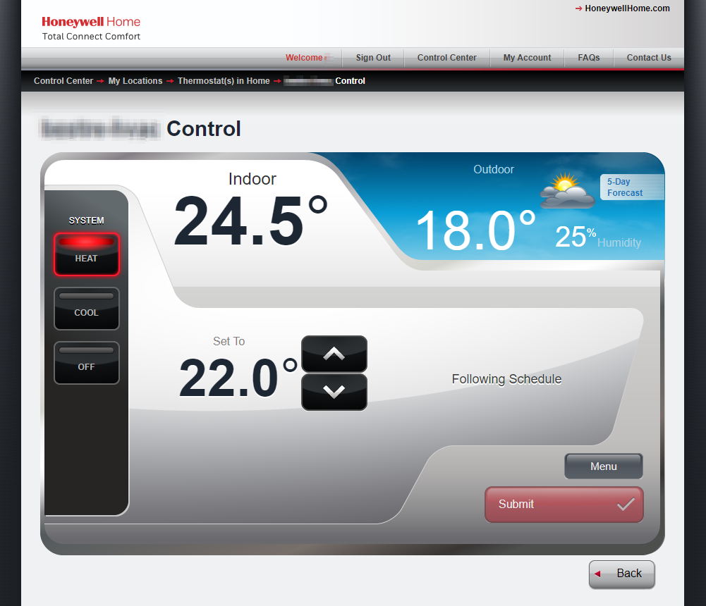
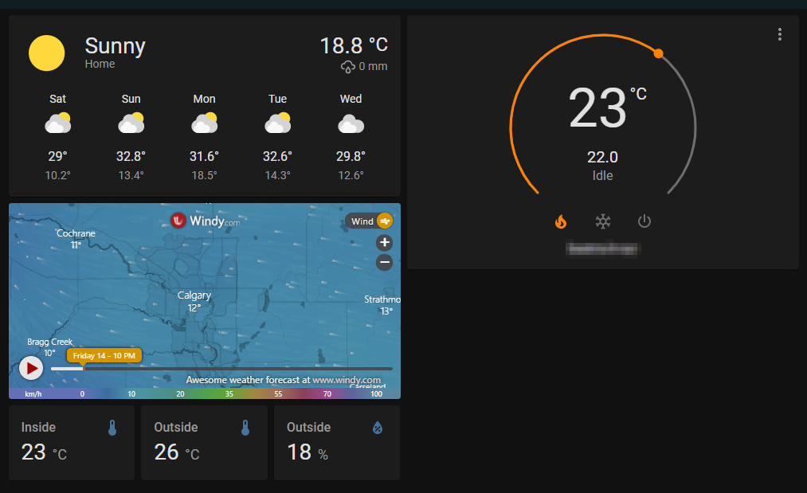

## The Scenario, The Challenge

So it's been a few months since my last post, and I decided to jump into the deep end of the home automation game... 🙃

My house has a Honeywell RedLINK system installed that controls the heating and cooling functions. Turns out this system can be extended with [outdoor sensors](https://www.amazon.ca/gp/product/B004MH7YE2) and an [internet gateway](https://www.amazon.ca/gp/product/B0783HK9ZZ). Nice! Now I can take this currently pretty dumb system and make it smart(er) by simply plugging in a gateway device from Honeywell and connecting a temperature/humidity sensor outside.

Ideally I would be able to control my climate system and see what the weather is like outside from anywhere. Wouldn't it be nice if I could get all that in one simple sleek interface that works on any device? Honeywell have a web portal that allows you to see and control the system, but the site is horrendously out of date. The interface looks like it's straight out of the 90s.

It doesn't really lend itself to the idea of integrating with every other "smart" device I may add in the future either.

## The Solution

Enter [Home Assistant](https://www.home-assistant.io/). This clever platform allows you to integrate all your IOT devices into a single ecosystem with a nice looking customizable interface. It also allows you to create all kinds of automations and generally makes managing your home full of IOT devices easier. Added bonus: it's efficient enough to run on a Raspberry Pi. Hey, I happen to have one of those laying around and since it's only running a network ad blocker, it's basically idling most of the time. Perfect coincidence.

Not only that, but there already exists an [integration](https://www.home-assistant.io/integrations/honeywell/) for the Honeywell Total Comfort Connect service (TCC).

Here was the next challenge, this integration is pretty bare bones and no longer supported by the original developer. It was implemented as a simple climate-type "platform" integration which doesn't allow for the additional outdoor sensor. Also this is no longer up to date with the best practices for the Home Assistant project since it can only be setup directly in `configuration.yaml`.

Also I don't really no anything about how large Python projects work, so there's that... 🤔

This made for an excellent opportunity for me to upgrade my Python skills. I had to learn about how types, testing, mocking, and many other common dev tasks are done in python on my journey to upgrade this Honeywell integration. I will say this however, there are many tools in the Home Assistant project that make all the standards easy to understand and follow. Everything from code styles, test coverage, import handling, etc. are all automatically run and checked as commit hooks. It really makes for cleaner PRs and an overall pretty slick development experience.

After a few days of stumbling my way around this huge Python project I was able to convert the Honeywell climate platform into a full fledged integration with climate and sensor platforms. With that I can throw together a nice clean looking dashboard:

Additional bonus, now I can integrate this with cameras and what ever other neat IOT toys I can get to pass the Partner Approval Process. 😉

## The Work

If you're interested in the work behind this, here are the PRs:  
**Honeywell integration:** https://github.com/home-assistant/core/pull/50547 
**Home Assistant Docs:** https://github.com/home-assistant/home-assistant.io/pull/17814
