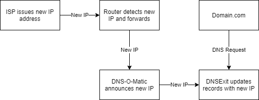

## A Tale of Subdomains and DNS Records
Problem: turns out I was modifying the wrong DNS records. 🙃

I bought my domain through [Domain.com](https://www.domain.com/) but I had pointed all DNS records to [DNSExit.com](https://www.dnsexit.com) (more on this later). So when I modified the DNS records at Domain.com nothing changed. I thought maybe I need to wait for 2 days for the changes to take affect, but even after 2 days certbot was still throwing NXDOMAIN lookup errors when I tried to generate SSL certs for my new sub domain.

## Why DNSExit Anyway??
Major ISPs in Canada do not provide static IPs for home internet plans so I had to setup a process to update DNS records any time my IP address changes. Enter [DNS-O-Matic](https://www.dnsomatic.com), this is one of the dynamic IP announcing services supported directly by the router I'm using. So anytime my router detects the IP address has changed, it pings DNS-O-Matic with the new IP where DNS-O-Matic can then forward that IP change to my DNS service. Lo! DNS-O-Matic only supports certain DNS services, and Domain.com was not one of them. Perhaps Domain.com doesn't offer dynamic DNS services or perhaps DNS-O-Matic just haven't developed integration with Domain.com, who knows. So this is where DNSExit comes in. I point my Domain.com domain DNS servers to DNSExit and manage all DNS records from DNSExit.

It all ends up looking like this:

## Telus to the Rescue
And this where I remembered that my DNS records are not actually managed through Domain.com. When the [Telus](https://www.telus.com) technician started up my new internet and the website just continued to magically work I remembered that my DNS records were actually with DNSExit, not Domain.com. Once I added a subdomain in DNSExit, certbot was able to lookup the new subdomain and AMP was able to create the appropriate Nginx config. All is right with the world!

As an additional bonus, my new Telus plan is way faster for less money. 🚀

Now there is no Steam game download that can stop me!