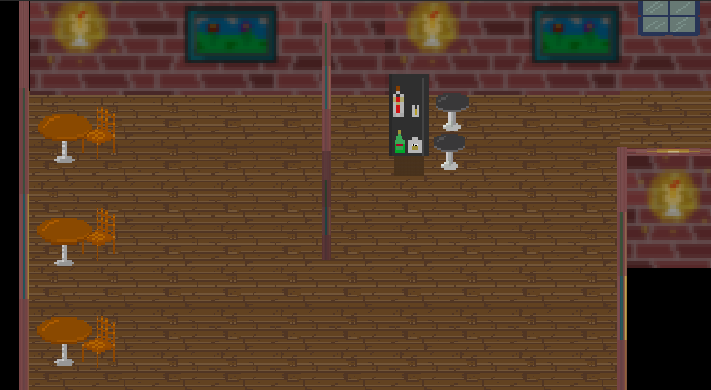

## New Website

I've updated my personal site to yet another web framework - [Gatsby](https://www.gatsbyjs.com/). I decided to do this after much reflection on my old site (built using only [React](https://reactjs.org/)) and realizing that it had too much junk. I wanted a simple, easy to maintain, clean site where I can link off to other side projects easily. Gatsby provides a relatively easy to use and modular framework to build sites, and adding a blog to it was easy. Yay

## Old Unity Game

In order to make an old Ludum Dare project I worked on ages ago compatible with modern React websites I had to upgrade the project to the latest LTS version of Unity. This was actually pretty straight forward as Unity has an automatice upgrade process. The problem was that we used deprecated GUI components in our game that had to be manually converted to the newer UI components. Simply upgrading the project without manually converting these to UI components resulted in no UI being rendered in the game, making it pretty difficult to navigate the main menu!

Not a very useful main menu.

I'm hoping to join another Ludum Dare in the near future, these make for an incredibly fun and rewarding weekend. #:+1:
