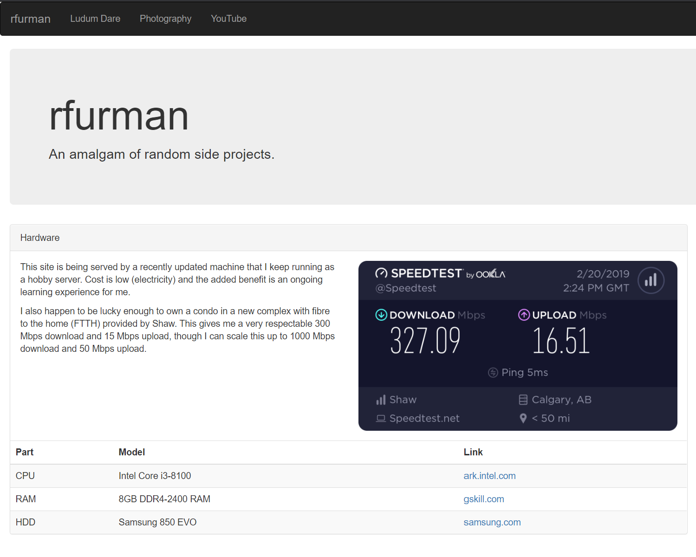

## New Website

I've updated my personal site to yet another web framework - [Gatsby](https://www.gatsbyjs.com/). I decided to do this after much reflection on my old site (built using only [React](https://reactjs.org/)) and realizing that it had too much junk. I wanted a simple, easy to maintain, clean site where I can link off to other side projects easily. Gatsby provides a relatively easy to use and modular framework to build sites, and adding a blog to it was easy.

Old website:

The old site used [Bootstrap](https://getbootstrap.com/) for the front end and React. This worked fairly well for a purely static website but Gatsby made it so easy to add all sorts of very useful features such as:

- Quick and easy to implement markdown parser for a blog (gatsby-transformer-remark)
- SEO with react helmet
- Easy state via GraphQL
- Familiar component pattern using React

And now here I am, with yet another website refresh. 😉

## Old Unity Game

In order to make an old Ludum Dare project I worked on ages ago compatible with modern React websites I had to upgrade the project to the latest LTS version of Unity. This was actually pretty straight forward as Unity has an automatice upgrade process. The problem was that we used deprecated GUI components in our game that had to be manually converted to the newer UI components. Simply upgrading the project without manually converting these to UI components resulted in no UI being rendered in the game, making it pretty difficult to navigate the main menu.

Not a very useful main menu.

Anyhow, after a couple hours of rebuilding the UI using new components everything is fully upgraded and running over on the [Ludum](/ludum) page. I'm hoping to join another Ludum Dare in the near future, these make for an incredibly fun and rewarding weekend. 👍

## Future

Anytime I work on some interesting personal devops project I will write about it. For example I plan on getting [Application Management Panel (AMP)](https://cubecoders.com/AMP) to run along side this personal website. I also recently acquired an extra machine I'd like to use with my current server to make a personal hobby server farm. Stay tuned for updates!

New Year's resolution: post once a month on this blog. 🎉
